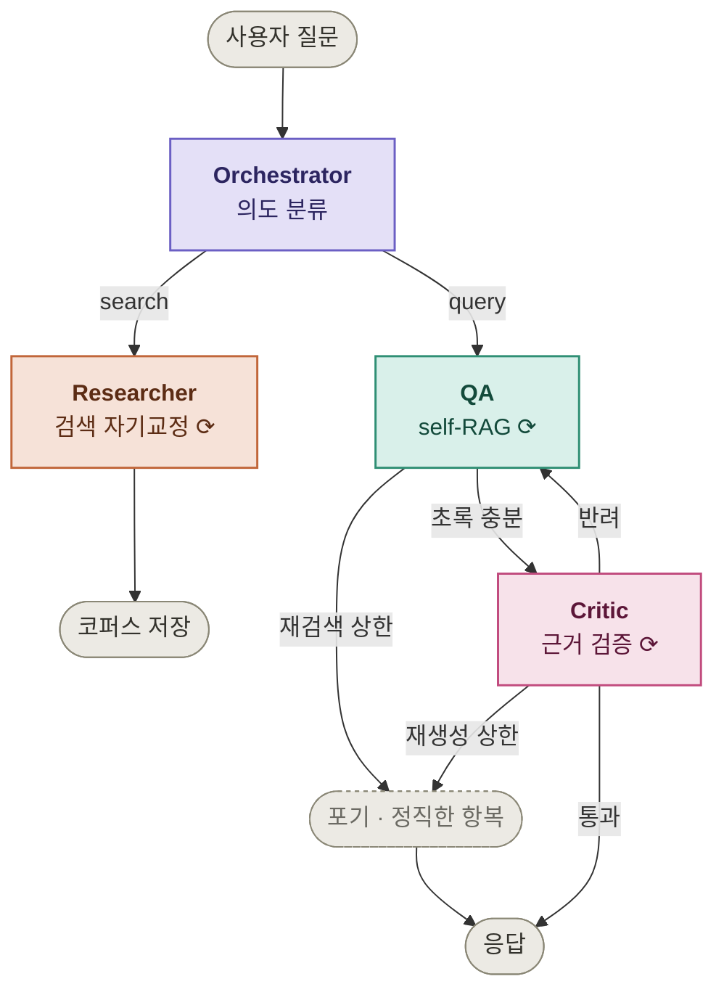

# PaperPilot

논문 주제를 검색해 관련 논문을 찾고, 근거 기반으로 질의응답하는 **순차 멀티 에이전트** 연구 어시스턴트

> 설계 문서는 [docs/architecture.md](docs/architecture.md) 참고

## 아키텍처



각 노드는 단순 함수 호출이 아니라 **결과를 보고 스스로 다음 행동을 결정하는 에이전트**

| 에이전트 | 역할 |
| --- | --- |
| Orchestrator | 의도 분류 → Researcher/QA 라우팅 |
| Researcher | arXiv 검색 → 결과 부적합하면 쿼리 수정 후 재검색 |
| QA | 검색된 초록으로 self-RAG 질의응답, 근거 부족하면 재검색 |
| Critic | 생성된 답변이 초록에 실제 근거하는지 검증, 미근거면 QA에 반려 |

## 요청 처리 흐름

위 다이어그램이 실제로 어떻게 도는지 두 경로로 풀어봄

### 케이스 1 — QA 경로: self-RAG 재검색

`"RAG에서 환각을 줄이는 방법은?"` 질문이 아래 [API](#api) 예시의 `search_retries: 1`을 만들어내는 과정 ([src/agents/qa.py](src/agents/qa.py))

1. **Orchestrator** — `intent: "query"`로 분류 → QA로 라우팅
2. **retrieve** — 원본 질문으로 초록 top-5 검색
3. **check_sufficiency** — 검색된 초록만으론 답하기 부족하다고 판정(`sufficient: false`), 재검색용 쿼리 제안
4. **rewrite_query** — 제안된 쿼리로 교체, `search_retries` 1 증가
5. **retrieve** — 새 쿼리로 재검색
6. **check_sufficiency** — 이번엔 충분하다고 판정(`sufficient: true`)
7. **generate_answer** — 검색된 초록만 근거로 답변 생성, `[paper_id]` 인용 포함
8. **critic** — 답변의 모든 주장이 초록에 근거함을 확인(`grounded: true`) → 응답

재검색·근거검증이 몇 번 일어났는지가 **응답 필드에 그대로 노출**되는 것이 핵심 — 자기교정이 로그 뒤가 아니라 API 응답에서 보임

### 케이스 2 — Researcher 경로: CRAG 필터링

`"diffusion model 관련 논문 찾아줘"` 같은 검색 요청이 처리되는 과정 ([src/agents/researcher.py](src/agents/researcher.py))

1. **Orchestrator** — `intent: "search"`로 분류 → Researcher로 라우팅
2. **to_search_keyword** — 한국어 요청 문장을 arXiv 검색용 영어 키워드로 변환
3. **expand_query** — 같은 주제를 가리키는 공식 기술 용어로 대체 검색어 생성 (원본 키워드가 놓치는 논문 확보, recall)
4. 원본 키워드·대체 검색어 두 결과를 병합
5. **filter_relevant** — 병합된 후보 중 검색어와 **직접** 관련된 논문만 LLM이 채점해서 남김 (비슷한 기법을 다른 분야에 쓴 논문 등 오염 제거, precision)
6. 필터 통과 개수가 기준(3편) 미달이면 검색 범위를 넓혀 재검색 (최대 2회)
7. 통과한 논문만 FAISS 인덱스에 저장

> 실제 배포 검증 중 이 경로로 코퍼스가 48편에서 58편으로 늘어난 사례 확인 — 검색 자기교정이 실제로 코퍼스를 키움

## 주요 기능
- 주제 검색 → 관련 논문 목록·초록·메타데이터 수집 (arXiv)
- 초록 기반 RAG 질의응답 (Self-RAG / CRAG)
- 답변 근거 검증으로 환각 억제 (Reflection)

## 기술 스택

| 영역 | 선택 |
| --- | --- |
| 오케스트레이션 | LangGraph |
| LLM | Claude API |
| 논문 검색 | arXiv API |
| 임베딩 | sentence-transformers (`all-MiniLM-L6-v2`) |
| 벡터 DB | FAISS |
| 서빙 | FastAPI (Router-Controller, LangGraph 엔진을 감싸는 HTTP 어댑터) |

## 프로젝트 구조
```
app.py              # FastAPI 진입점 (HTTP 어댑터)
src/
├── main.py         # CLI 진입점 (graph.invoke)
├── config.py       # 코퍼스 경로 설정
├── search.py       # arXiv 검색
├── embedding.py    # 문장 → 벡터
├── ingest.py       # 임베딩 → FAISS 저장
├── retriever.py    # FAISS 벡터 검색
├── llm.py          # Claude API 래퍼
├── graph.py        # LangGraph 배선
└── agents/
    ├── orchestrator.py
    ├── researcher.py
    ├── qa.py
    └── critic.py
eval/               # 평가 하네스 (검색·Critic·QA scorecard)
tests/              # 유닛·통합 테스트 (pytest)
data/               # FAISS 인덱스 + 논문 메타데이터
```

## 실행

**설치**
```bash
pip install -r requirements.txt
cp .env.example .env   # ANTHROPIC_API_KEY 입력
```

**API 서버**
```bash
PYTHONPATH=src uvicorn app:app --port 8000 --workers 1
```
브라우저에서 `http://localhost:8000/docs` — Swagger UI로 바로 시연 가능

> `--workers 1` 필수 — 코퍼스 쓰기를 프로세스 내 락으로 보호하므로 워커가 여럿이면 락이 무효

**CLI**
```bash
PYTHONPATH=src python src/main.py "RAG에서 환각을 줄이는 방법은?"
```

**테스트**
```bash
pytest
```

**Docker**
```bash
docker build -t paperpilot .
docker compose up -d       # 볼륨(./data) · env_file · healthcheck 포함
docker compose logs -f
```

## 배포

EC2 단일 인스턴스 + Docker + 볼륨 마운트

```
사용자 → EC2(t4g.small, ARM) → 컨테이너(uvicorn --workers 1)
                                    └ /app/data ← 호스트 볼륨 (코퍼스 영속성)
```

| 항목 | 선택 | 이유 |
| --- | --- | --- |
| 인스턴스 | `t4g.small` (ARM/Graviton) | 빌드 머신이 Apple Silicon이라 아키텍처 일치 · torch+임베딩 모델이 500~800MB라 1GB 인스턴스는 OOM |
| 이미지 | CPU 전용 torch | 기본 휠은 CUDA 라이브러리가 딸려와 8.89GB → **2.17GB** |
| 데이터 | 볼륨 마운트 | 이미지에 넣으면 재배포 때마다 수집한 논문이 초기화됨 |
| 워커 | 1개 고정 | 코퍼스 쓰기 락이 프로세스 내에서만 유효 |

EC2에는 코드를 두지 않고 `docker-compose.yml` · `.env` · `data/` 세 가지만 전송한 뒤 레지스트리에서 이미지를 받아 실행

## API

| 엔드포인트 | 인증 | 용도 |
| --- | --- | --- |
| `POST /ask` | **필요** | 논문 검색 요청 또는 질의응답 (**Orchestrator가 의도를 판단해 라우팅**) |
| `GET /health` | 불필요 | 헬스체크 (컨테이너 healthcheck가 호출) |

**인증** — `PAPERPILOT_TOKEN`이 설정돼 있으면 `X-API-Token` 헤더 필요

```bash
curl -X POST http://<host>:8000/ask \
  -H "Content-Type: application/json" \
  -H "X-API-Token: <토큰>" \
  -d '{"question":"RAG에서 환각을 줄이는 방법은?"}'
```

> 배포 환경의 공인 IP가 유동적이라 방화벽 IP 제한만으로는 운용이 어려워, 포트는 열고 애플리케이션에서 토큰을 검사하는 방식을 선택. 미설정 시 인증을 걸지 않으므로 **배포 후 토큰 없이 호출해 401이 나오는지 확인 필요**

요청·응답 예시
```jsonc
// POST /ask
{ "question": "RAG에서 환각을 줄이는 방법은?" }

// 200 OK
{
  "intent": "query",              // Orchestrator의 판단 (search / query)
  "answer": "...[2510.22344v1]...",
  "papers": [{ "paper_id": "2510.22344v1", "title": "FAIR-RAG: ..." }],
  "grounded": true,               // Critic 근거 검증 통과 여부
  "search_retries": 1,            // QA가 재검색한 횟수 (self-RAG)
  "critic_runs": 1,               // Critic 검증 횟수 (1 = 한 번에 통과)
  "gave_up": false,
  "give_up_reason": null
}
```

`search_retries`·`critic_runs`·`grounded`를 응답에 노출해 **에이전트의 자기교정·검증 과정이 밖에서 보이도록** 구성

| 상태 코드 | 상황 |
| --- | --- |
| 200 | 답변 성공 또는 **정직한 항복**(`gave_up: true`) |
| 422 | 입력 형식 오류 |
| 503 | LLM 서비스 접근 불가 |

> arXiv 장애는 500이 아니라 **200 + 항복 메시지** — 시스템은 정상 동작했고 외부 검색만 실패한 상황이므로

## 알려진 한계

- **의도 분류 오분류** — `temperature=0`으로 줄였으나 20회 표본에서 15% 잔존. 질문을 검색 요청으로 오분류하면 논문 목록이 반환됨
- **코퍼스 밖 주제는 답변 불가** — 재검색 상한 후 정직하게 항복. 질의응답 중 자동 수집은 Future Work
- **초록에 없는 세부사항 답변 불가** — 초록 레벨 MVP이므로 PDF 전문 파싱은 Non-Goal
- **단일 워커 전제** — 코퍼스 쓰기를 프로세스 내 락으로 보호. 스케일 아웃 시 벡터 DB 이전 필요
- **arXiv 요청 제한** — 검색 1회가 arXiv를 최대 4회 호출. 반복 호출 시 HTTP 429로 일시 차단되며, 이때는 검색 실패를 정직한 항복 메시지로 반환

## 문서
- [docs/architecture.md](docs/architecture.md) — Goals/Non-Goals, Agent Design, Design Decisions
- [docs/decisions.md](docs/decisions.md) — ADR
- [docs/evaluation.md](docs/evaluation.md) — 평가 방법
- [eval/results.md](eval/results.md) — 측정 결과

---
## 회고
[PaperPilot 회고 벨로그](https://velog.io/@dan9872/series/PaperPilot-%ED%94%84%EB%A1%9C%EC%A0%9D%ED%8A%B8-multi-agent-%ED%94%84%EB%A1%9C%EC%A0%9D%ED%8A%B8)
