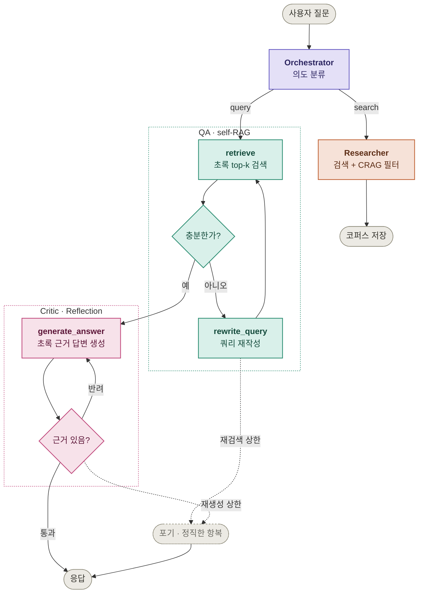

# PaperPilot — Design Doc

논문 주제를 검색해 관련 논문을 찾고, 질의응답·요약을 제공하는 **순차 멀티 에이전트 연구 어시스턴트**

---

## Overview

연구자가 새 분야를 조사할 때 반복하는 흐름 — **검색 → 스크리닝 → 정독 → 검증** — 중 앞단(검색·스크리닝·근거 기반 질의응답)을 자동화

논문 초록(abstract) 레벨의 RAG를 기본으로 하고, Orchestrator가 사용자 의도에 따라 처리 경로를 라우팅

**설계 원칙:** 각 노드는 단순 함수·LLM 1회 호출이 아니라 **결과를 보고 스스로 다음 행동을 결정하는 에이전트** (리트머스: "결과를 보고 자기 행동을 바꾸는가?") — 이 기준으로 초기 설계의 Comparator를 제외 → [[ADR-001]]

---

## Goals / Non-Goals

### Goals
- 주제 검색 → 관련 논문 목록·초록·메타데이터 수집
- 초록 기반 RAG 질의응답
- 의도별 라우팅 (Orchestrator)
- 각 노드의 자기교정(self-correction) 루프
- 생성 답변의 근거 검증(Critic) — 환각 억제

### Non-Goals (→ Future Work)
- **PDF 전문(full-text) 파싱·인덱싱** — 다운로드·파싱·청킹은 별도 하위 시스템 → v2 (초록으로 스크리닝 후 선택 논문만 정독하는 2단 구조 전제)
- **전문 기반 요약** — 초록은 이미 요약이라 가치 낮음, 전문 확보 후 승격
- **병렬 fan-out** (하위주제 분해 → Researcher N개 동시 실행) — 순차로 핵심 루프 검증 후 확장
- 논문 저장·라이브러리 관리 UI 고도화

---

## Architecture

README의 다이어그램은 4-agent 개념도이고, 아래는 `graph.py`의 실제 노드명·조건까지 보이는 구현 레벨 버전

- **Orchestrator**: 요청을 `search`(검색·저장) / `query`(질의응답)로 분류해 워커로 라우팅
- **Researcher·QA**: Orchestrator가 의도 보고 **둘 중 하나** 선택하는 형제 워커 (QA는 `retrieve`~`rewrite_query` subgraph로 펼침)
- **Critic subgraph**: 라우팅 대상이 아니라, QA가 답을 만들면 **그 뒤에 자동으로 붙어** 근거를 검사하는 리뷰어
- **subgraph 안의 순환**: 결과를 평가해 필요하면 스스로 재시도하는 자기교정 루프 — `retrieve↔rewrite_query`(재검색), `generate_answer↔critic`(재생성)
- **노드 분해 기준**: 다른 에이전트와 사이클로 얽히면 펼치고(QA), 자기 안에서만 돌면 통째로 둠(Researcher)

---

## Agent Design

각 노드가 "에이전트"인 근거 — **결과를 보고 스스로 다음 행동을 결정** (없으면 정적 파이프라인·도구)

| 에이전트 | Layer | 자율 행동 | 패턴 |
| --- | --- | --- | --- |
| **Orchestrator** | 1 | 의도 분류(`enum`으로 `search`/`query` 강제) → 워커 라우팅 | Routing |
| **Researcher** | 2 | 넓게 검색 후 **논문별 관련성을 채점해 솎아냄**, 통과분 부족하면 후보 확장 후 재필터 | Self-correction / CRAG |
| **QA** | 2 | 검색된 초록으로 답변 가능한지 판정, 부족하면 **쿼리 재작성 후 재검색** | Self-RAG / CRAG |
| **Critic** | 3 | 답변이 초록에 실제 근거 있는지 채점, 미근거면 **QA에 재작성 반려** | Reflection / Generator-Critic |

---

## Components

| 컴포넌트 | 계층 | 책임 |
| --- | --- | --- |
| **Orchestrator** | 에이전트 | 의도 분류 → 라우팅 |
| **Researcher** | 에이전트 | 논문 검색 + 결과 평가 → 쿼리 자기교정 → 저장 |
| **QA** | 에이전트 | 검색 충분성 판단 → 재검색 or 근거 기반 답변 |
| **Critic** | 에이전트 | 답변 근거 검증 → 통과 or QA 반려 |
| Ingestor (`ingest.py`) | 도구 | 초록·메타데이터 임베딩 → 벡터 DB (`paper_id` 태깅) |
| Retriever (`retriever.py`) | 도구 | 벡터 유사도 검색 (메타데이터 필터 지원) |
| Embedder (`embedding.py`) | 도구 | 문장 → 벡터 |
| arXiv API (`search.py`) | 도구 | 논문 검색 |
| LLM (`llm.py`) | 도구 | Claude API 래퍼 (모든 에이전트 공용 판단 창구, 구조화 출력) |

---

## Evaluation

| 지표 | 측정 |
| --- | --- |
| 검색 관련도 | 주제 쿼리 대비 반환 논문 적합률 (자기교정 전/후 비교) |
| RAG 정확도 | 질의응답의 근거 일치 / 환각 여부 |
| 자기교정 효과 | 재검색 발동률, 재검색 후 개선폭 |
| Critic 효과 | 반려율, 반려 후 근거 일치 개선폭 |

---

## Future Work

| 항목 | 상태 |
| --- | --- |
| PDF 전문 인덱싱 + 요약 | 초록 스크리닝 후 선택 논문만 정독하는 2단 구조 전제 |
| 병렬 fan-out (하위주제 분해) | 순차로 핵심 루프 검증 후 확장 (`Send` map-reduce + Synthesizer 병합) |
| 복합 요청 다단계 처리 | "찾아서 알려줘" 같은 복합 요청 — Supervisor Planning 필요하나 MVP엔 복잡도 대비 이득 없어 보류 |
| 진행 상황 스트리밍 | `graph.invoke()` 대신 `graph.stream()`으로 중간 단계 노출 (검색 경로 30~60초 대기) |
| QA → Researcher 폴백 | QA에서 근거 초록 없을 경우 논문 검색으로 풀백 기능 구현 예정 |
| Semantic Scholar 인용 그래프 | 검색 주제에 해당하는 원논문, 인용논문 검색 기능 구현 예정 |